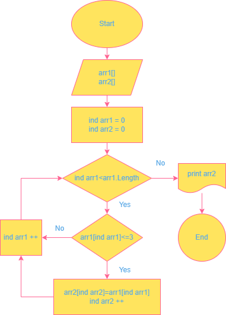

# Задача
Написать программу, которая из имеющегося массива строк формирует новый массив из строк, длина которых меньше, либо равна 3 символам. Первоначальный массив можно ввести с клавиатуры, либо задать на старте выполнения алгоритма. При решении не рекомендуется пользоваться коллекциями, лучше обойтись исключительно массивами.
# Алгоритм решения задачи
1. Объявляем два массива: первый - это исходный массив, который нужно преобразовать, и второй массив для записи информации после обработки первого массива.
2. Проверяем каждый элемент первого массива на соответствие условию.
3. Записываем, элементы, удовлетворяющие условию, во второй массив. 
4. Выводим второй массив.
## Графическое представление массива
